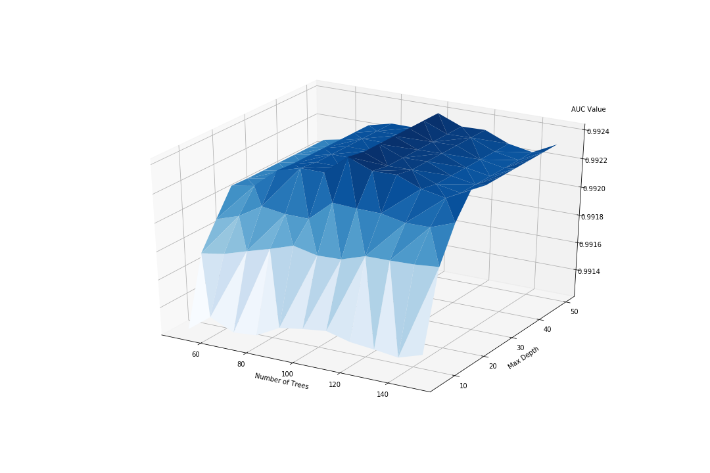

## 本次使用到的库:
* pandas
* sklearn
* numpy
* pickle
* matplotlib
* mpl_toolkits
* apyori

## 文件结构简述:
可执行代码 [Test01_Answer.py](Test01_Answer.py), [Test02_Answer.py](Test02_Answer.py) 放在本文件夹根目录下.  
具体解题步骤使用了 ipynb 文件进行说明, 同处于根目录下.
代码中使用到的 data 存放在 [src](./src/) 文件夹下.  
Test 01 的输出结果存放在 [output_q1](./output_q1/) 文件夹下: [output.txt](./output_q1/output.txt), [result.png](./output_q1/result.png)  
Test 02 的输出结果存放在 [output_q2](./output_q2/) 文件夹下: [output.txt](./output_q2/output.txt)

## Test 01:
### Random Forest 模型:
>由于数据集中 features 数目较多, 选用Random Forest可以有效地降低 irrelevant features 的影响
### 使用Grid Search来优化参数:
选取的两个待优化参数为
* **n_estimators**: 树的数量 50~100
* **max_depth**: 树的最大深度 5~50  
这两个参数有低变高时都可以有效地 降低 training loss, 但如果太高了, 就会导致 overfitting, 所有需要找到一个合适的取值.

本次Grid Search 采用了 5-fold cross validation来优化参数, 判断标准为 **AUC value**.  

注意: 本次 Training过程使用了 8 个 cpu core, 总耗时约 9 分钟.  
电脑CPU较差请勿运行, 请直接使用 pickle load 已保存在 **output_q1** 文件夹下的 *rf_GridSearchCV.pickle* 文件

### 结果:
最佳 AUC Value是  0.9924, 此时选用了 max_depth: 20, n_estimators: 100  
此次得到的最佳分类器为: 
```
RandomForestClassifier(bootstrap=True, class_weight=None, criterion='gini',
            max_depth=20, max_features='sqrt', max_leaf_nodes=None,
            min_impurity_decrease=0.0, min_impurity_split=None,
            min_samples_leaf=20, min_samples_split=100,
            min_weight_fraction_leaf=0.0, n_estimators=100, n_jobs=None,
            oob_score=False, random_state=1117, verbose=0,
            warm_start=False)
```
最后根据AUC为标准的参数优化过程的三维图



## Test 02
在导入dataset为dataframe后, 首先根据 dataframe的value获得一个 2D Array.  
在新的 list 中, 每一个子列表都是一个transaction.   

然后使用 使用apyori库中的apriori方法 获得 support>=0.1, confidence >= 0.7 的Rule, 最大长度为3的 Association Rules.  
接着筛选出 右侧为 "Label" 的 Rules, 总计233条.

最后将结果输出到[output_q2](./output_q2/) 文件夹下: [output.txt](./output_q2/output.txt)
